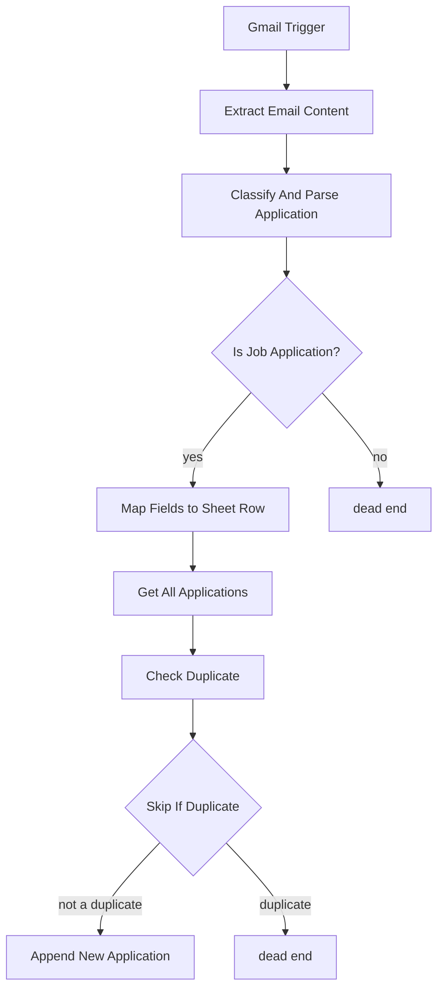

# Architecture

## Flow diagram

GitHub renders Mermaid diagrams natively in Markdown, so this stays in sync without
needing a separate image file:

## Node-by-node

| Node | Type | Purpose |
|---|---|---|
| Gmail Trigger | Trigger | Polls Gmail every minute |
| Extract Email Content | Code | Pulls subject/from/to/date/snippet/body from the raw Gmail payload — handles both the "simplified" and "raw" Gmail API response shapes |
| Classify And Parse Application | Code | Classifies confirmation vs. non-confirmation (including job alert digests), extracts Company/Job Title/Date/Source/Location/Employment Type/Recruiter/Job URL/Application ID, categorizes Job Type |
| Is Job Application? | IF | Routes non-applications to a dead end |
| Map Fields to Sheet Row | Set | Maps extracted fields to the sheet's column names |
| Get All Applications | Google Sheets | Reads existing rows for duplicate comparison |
| Check Duplicate | Code | Company + Job Title match, normalized to strip corporate suffixes (Inc, LLC, Corp, etc.) |
| Skip If Duplicate | IF | Routes duplicates to a dead end |
| Append New Application | Google Sheets | Appends the new row |

## Where the extraction logic lives

All classification and field-extraction logic is in the **Classify And Parse Application**
code node. It's layered, roughly in this priority order:

1. Combined "title at company" sentence patterns (several phrasings and orderings,
   including the LinkedIn Easy Apply block layout where title/company sit on separate
   lines with no connecting sentence)
2. Platform-specific patterns for LinkedIn and Indeed confirmation wording
3. Workday-specific fallback: company pulled from the `*.wdN.myworkdayjobs.com` URL when
   it's never stated in plain text
4. Signature-line fallback (e.g. "Purolator Talent Acquisition Team", "The VITALL Team")
5. "From" header display name, excluding known ATS/job-board senders

Every extracted company/job title also passes a plausibility check (word count, length,
common filler-word rejection) before being accepted — this catches greedy regexes that
latch onto unrelated boilerplate sentences instead of the real value, and falls through to
the next priority (or a blank cell) rather than keeping garbage.
