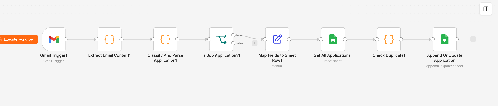
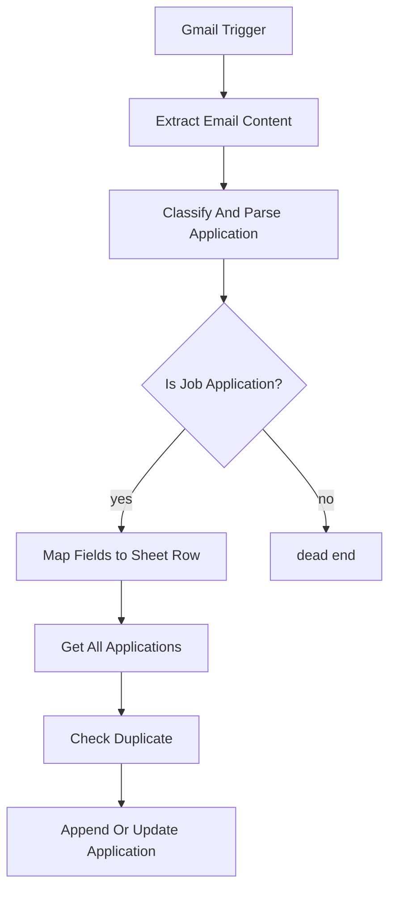

# Architecture

## Flow diagram

GitHub also renders Mermaid diagrams natively in Markdown, so this version stays in sync
even if the screenshot above goes stale:

## Node-by-node

| Node | Type | Purpose |
|---|---|---|
| Gmail Trigger | Trigger | Polls Gmail every minute |
| Extract Email Content | Code | Pulls subject/from/to/date/snippet/body from the raw Gmail payload — handles both the "simplified" and "raw" Gmail API response shapes |
| Classify And Parse Application | Code | Classifies confirmation vs. non-confirmation (including job alert digests), extracts Company/Job Title/Date/Source/Location/Employment Type/Recruiter/Job URL/Application ID, categorizes Job Type, detects pipeline Status (see below) |
| Is Job Application? | IF | Routes non-applications to a dead end |
| Map Fields to Sheet Row | Set | Maps extracted fields to the sheet's column names |
| Get All Applications | Google Sheets | Reads existing rows for duplicate/status comparison |
| Check Duplicate | Code | Company + Job Title match, normalized to strip corporate suffixes (Inc, LLC, Corp, etc.); guards against a stale email downgrading a further-along Status |
| Append Or Update Application | Google Sheets | Upserts on a single "Match Key" column (n8n's upsert only supports one matching column — confirmed against a live instance, not a version issue) — appends a new row if no match, otherwise updates the existing row (used for status changes) |

## Automatic status updates

A later email about an application already in the sheet — an interview invite, an
assessment link, an offer, a rejection — updates that row's **Status** column instead of
creating a duplicate entry. Detected from email subject/sender/body against a fixed set of
phrase patterns, checked in this priority order so an email mentioning more than one stage
(e.g. a rejection that references an earlier interview) resolves to the correct one:

1. **Accepted** — "welcome to the team", "welcome aboard", offer acceptance confirmations
2. **Offer** — "we are pleased to offer", "offer letter", "extend an offer"
3. **Rejected** — "no longer under consideration",
   "decided to pursue other candidates", "we regret to inform you"
4. **Interviewing** — "schedule an interview", "interview invitation", "book a time to chat"
5. **OA/Assessment** — "online assessment", "coding challenge", "take-home assignment"
6. **Ghosted** — "no longer accepting applications", "this role has
   been filled"
7. **Applied** — the default/fallback when none of the above match (the original
   confirmation-email behavior)

Patterns are deliberately multi-word phrases rather than bare keywords ("interview",
"offer", "assessment" alone) specifically to avoid misclassifying unrelated emails that
happen to contain those common words.

**Matching an update to the right row:** n8n's "Append or Update Row" operation only
supports matching on a single column, not two — so Company + Job Title can't be used
directly. Instead, Check Duplicate computes a combined **Match Key** column
(`normalized-company::normalized-title`, same normalization as the duplicate check above)
and that single column is what the Google Sheets node actually matches on. Existing rows
need this column backfilled once — see `docs/setup.md`.

**Status never downgrades.** A rough progression order (Applied → OA/Assessment →
Interviewing → Offer → Accepted, with Rejected/Ghosted treated as terminal) means a stale
or re-sent email — e.g. a duplicate "thank you for applying" confirmation arriving after
an interview was already recorded — won't overwrite a status that's already further along.

## Where the extraction logic lives

All classification and field-extraction logic is in the **Classify And Parse Application**
code node. It's layered, roughly in this priority order:

1. Combined "title at company" sentence patterns (several phrasings and orderings,
   including the LinkedIn Easy Apply block layout where title/company sit on separate
   lines with no connecting sentence)
2. Platform-specific patterns for LinkedIn and Indeed confirmation wording
3. Workday-specific fallback: company pulled from the `*.wdN.myworkdayjobs.com` URL when
   it's never stated in plain text
4. Signature-line fallback (e.g. "Purolator Talent Acquisition Team", "The VITALL Team")
5. "From" header display name, excluding known ATS/job-board senders

Every extracted company/job title also passes a plausibility check (word count, length,
common filler-word rejection) before being accepted — this catches greedy regexes that
latch onto unrelated boilerplate sentences instead of the real value, and falls through to
the next priority (or a blank cell) rather than keeping garbage.